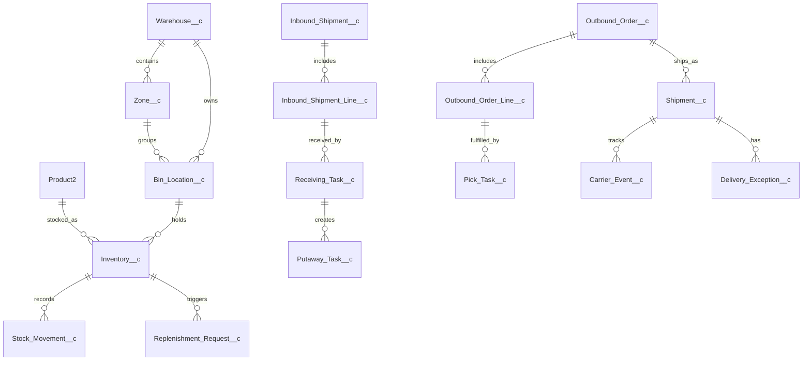

# Week 04 — Warehouse Management & Logistics Data Model

## Schema

## Object inventory

| Object | Role | Ownership / reporting |
| --- | --- | --- |
| `Warehouse__c` | Operating facility | Owner-based; warehouse-level reporting |
| `Zone__c` | Logical area within a warehouse | Lookup to Warehouse; zone capacity reports |
| `Bin_Location__c` | Physical storage bin | Lookup to Warehouse and Zone; unique external `Bin_Code__c` |
| `Product2` | Standard product catalog | Standard product reporting and SKU integration |
| `Inventory__c` | Product balance at a bin | Lookup to Product and Bin; inventory snapshot reporting |
| `Stock_Movement__c` | Immutable receipt, putaway, pick, count, or adjustment ledger | Master-detail to Inventory; movement audit reports |
| `Inbound_Shipment__c` / line | Supplier receipt header and lines | Header owns lines for receiving reports |
| `Receiving_Task__c` / `Putaway_Task__c` | Operational inbound work | User assignment, warehouse productivity reports |
| `Replenishment_Request__c` | Low-stock replenishment work | Lookup to Inventory; aging and exception reports |
| `Outbound_Order__c` / line | Customer fulfillment demand | Account lookup and order reporting |
| `Pick_Task__c`, `Package__c`, `Shipment__c` | Fulfillment and dispatch | User/warehouse reporting |
| `Carrier_Event__c` | Carrier tracking history | Master-detail to Shipment; delivery performance reports |
| `Delivery_Exception__c` | Delay, damage, loss, or address issue | Master-detail to Shipment; exception aging reports |

## Relationship rationale

- Master-detail is used for ledger/history children that have no business value without their parent (`Stock_Movement__c`, carrier events, delivery exceptions, inbound lines).
- Lookups preserve independent lifecycle and ownership for operational records such as bins, inventory, tasks, and replenishment requests.
- `Product2` and `Account` remain standard Salesforce objects, avoiding duplicated product and customer masters.
- External IDs are used for `Bin_Code__c`, `Zone_Code__c`, movement event reference, carrier event reference, and supplier/customer order references to support idempotent integrations.

## Sample records

| Object | Example |
| --- | --- |
| Warehouse | Istanbul DC (`IST-DC`) |
| Zone | Ambient Storage (`AMB`) |
| Bin | `IST-DC-AMB-A01-01` |
| Product | SKU `SKU-100`, Widget A |
| Inventory | 120 on hand, 20 reserved, 100 available |
| Stock Movement | Receive +40 from inbound shipment `ASN-10025` |
| Shipment | `SHP-00042`, carrier UPS, tracking `1Z999...` |
| Carrier Event | In Transit at 2026-08-19 09:30 UTC |
| Delivery Exception | Address issue, severity Medium |

## Data volume assumptions

- 5 warehouses, 20 zones per warehouse, and up to 10,000 bins per warehouse.
- 250,000 active inventory balances and 2–5 million stock movements annually.
- 50,000 shipments and 250,000 carrier events annually.
- Ledger and event objects require indexed external IDs, selective date filters, and archive/retention planning for reporting performance.
